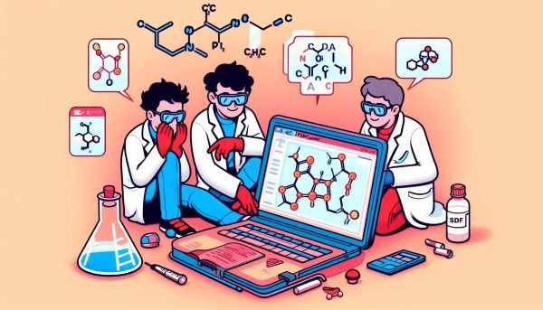

# 🧪 PubChemQuery



[](https://pepy.tech/projects/pubchemquery)
 
 
 
[](https://colab.research.google.com/drive/1hKrOe6K1L_fpd6_izhpVXaA1Zmq6Z8Fo?usp=sharing)

**🔬 PubChemQuery:** A Python Package for Accessing Chemical Information from [PubChem](https://pubchem.ncbi.nlm.nih.gov/).

PubChemQuery is a Python package that provides a simple and intuitive API for retrieving chemical information from the PubChem database. With this package, you can easily fetch chemical data, including:

* 🆔 CID (Compound ID) by name
* 📋 All CIDs by name
* 🖼️ 2D images by CID or name
* 📄 SDF (Structure Data File) by CID or name
* 📊 Compound properties, including:
    - ⚛️ Molecular formula and weight
    - 🔗 SMILES and InChI representations
    - ✏️ IUPAC name and title
    - 🧮 Physicochemical properties (e.g., XLogP, exact mass, TPSA)
    - 🔍 Structural features (e.g., bond and atom counts, stereochemistry)
    - 🔷 3D properties (e.g., volume, steric quadrupole moments, feature counts)
    - 👆 Fingerprint and conformer information

The package offers a straightforward interface, allowing users to access PubChem data with minimal code. Whether you're a chemist, researcher, or developer, PubChemQuery simplifies the process of integrating chemical information into your projects.

**✨ Key Features:**

- 🔎 Retrieve chemical data by name or CID
- 📸 Access 2D images and SDF files
- 📝 Get compound properties, including physicochemical, structural, and 3D features
- 🚀 Easy-to-use API with minimal code required

**📚 Simple and Concise API:**

There are functions that perform all of the above-mentioned tasks, making it easy to integrate PubChem data into your projects:

* `get_cid_by_inchi(inchi)`: *Get a CID by InChI*
* `get_cids_by_formula(formula)`: *Get CIDs by formula*
* `get_cid_by_name(name)`: *Get CID by name*
* `get_cids_by_name(name)`: *Get all CIDs by name*
* `get_image_by_cid(cid)`: *Get 2D image by CID*
* `get_image_by_name(name)`: *Get 2D image by name*
* `get_image_by_inchi(inchi)`: *Get 2D image by InChI*
* `get_structure_by_cid(cid)`: *Get SDF by CID*
* `get_structure_by_name(name)`: *Get SDF by name*
* `get_similar_structures_cids_by_compound_id(cid/SMILES/InChI)`: *Get similar structures CIDs by cid, SMILES, InChI*

**🧬 Compound Object:**
The package also includes a `Compound` object that encapsulates the retrieved data, providing a convenient way
to access and manipulate the data.

* `compound(cid_or_name)`: Create a compound object with properties and methods

**🚀 Getting Started:**

To use PubChemQuery, simply install the package and import it into your Python script. Refer to the example code snippets above for a quick start.

## 📥 Installation

Install PubChemQuery with pip

```python
  pip install PubChemQuery
```

## 💡 Examples

Import package as:

```python
import pubchemquery as pcq
```

Use the functions to retrieve data:

```python
# get a cid by formula
cid = pcq.get_cids_by_formula('C6H6')
print(type(cid), len(cid))
```

```python
# get a cid by inchi
cid = pcq.get_cid_by_inchi(
    'InChI=1S/C6H5NO3/c8-6-3-1-5(2-4-6)7(9)10/h1-4,8H')
print(cid)
```

```python
# get a cid by name
cid = pcq.get_cid_by_name('benzene')
print(cid)
```

```python
# get all cids by name
cids = pcq.get_cids_by_name('benzene')
print(type(cids), len(cids))
```

```python
# get 2d image
# by cid
image = pcq.get_image_by_cid('241')
image

# by name
image = pcq.get_image_by_name('benzene')
image

# by inchi
image = pcq.get_image_by_inchi(
    'InChI=1S/C6H5NO3/c8-6-3-1-5(2-4-6)7(9)10/h1-4,8H')
print(image)
```

```python
# get sdf by cid
sdf = pcq.get_structure_by_cid('241')
print(sdf)
```

```python
# get sdf by name
sdf = pcq.get_structure_by_name('benzene')
print(sdf)
```

```python
# get similar structure cids by cid
cids = pcq.get_similar_structures_cids_by_compound_id('241')

cids = pcq.get_similar_structures_cids_by_compound_id(
     'C1=CC=CC=C1', compound_id='SMILES')

cids = pcq.get_similar_structures_cids_by_compound_id(
    'InChI=1S/C6H6/c1-2-4-6-5-3-1/h1-6H', compound_id='InChI')

print(type(cids), len(cids))
```

Make a compound and then get its properties:

```python
# make a compound
cid = 2244
compound = pcq.compound(cid)
# name
name = '2-acetyloxybenzoic acid'
compound = pcq.compound(name)
print(compound)

# properties
# InChI
print(compound.InChI)
# InChIKey
print(compound.InChIKey)
# IUPACName
print(compound.IUPACName)
# similar structure cids
print(len(compound.similar_structure_cids))

# image
compound.image

# dataframe
compound.prop_df()
```

## ❓ FAQ

For any question, contact me on [LinkedIn](https://www.linkedin.com/in/sina-gilassi/) 


## 👨‍💻 Authors

- [@sinagilassi](https://www.github.com/sinagilassi)
